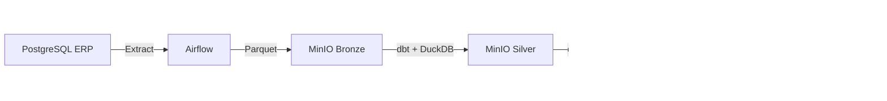

# Portfolio Summary

## What this project demonstrates

`modern-elt-stack` is an end-to-end local data platform designed to demonstrate how the main layers of a modern ELT architecture fit together without depending on a managed cloud environment.

The project intentionally separates transactional ingestion, object storage, transformation, orchestration, serving, and analytical exploration so each responsibility can be inspected independently.

## Architecture decisions

- **PostgreSQL as the source system**: represents an ERP-style OLTP workload rather than treating analytical storage as the source of truth.
- **MinIO as the data lake**: provides an S3-compatible object-storage layer and makes the bronze/silver/gold lifecycle visible locally.
- **Airflow for orchestration**: keeps extraction and transformation scheduling explicit and observable.
- **dbt + DuckDB for transformations**: separates transformation logic from orchestration while keeping the project lightweight enough to run locally.
- **Dremio and Jupyter as complementary consumption surfaces**: one provides an interactive lakehouse SQL experience, while the other supports exploratory analysis and notebooks.
- **Docker Compose as the execution boundary**: makes the architecture reproducible without requiring external infrastructure.

## Data flow

## Engineering themes

This repository is useful as a compact reference for:

- ELT and lakehouse fundamentals;
- medallion-style data organization;
- orchestration versus transformation responsibilities;
- Parquet and object-storage based analytics;
- dimensional modeling in a gold layer;
- local reproducibility with containers;
- analytical serving through multiple query surfaces.

## Scope

This is a learning and architecture sandbox, not a production platform. Production deployments would require additional work around secrets management, IAM, encryption, high availability, observability, data quality, lineage, CI/CD, infrastructure-as-code, backup policies, and workload isolation.

For setup, commands, service endpoints, and troubleshooting, see the main [`README.md`](README.md).
